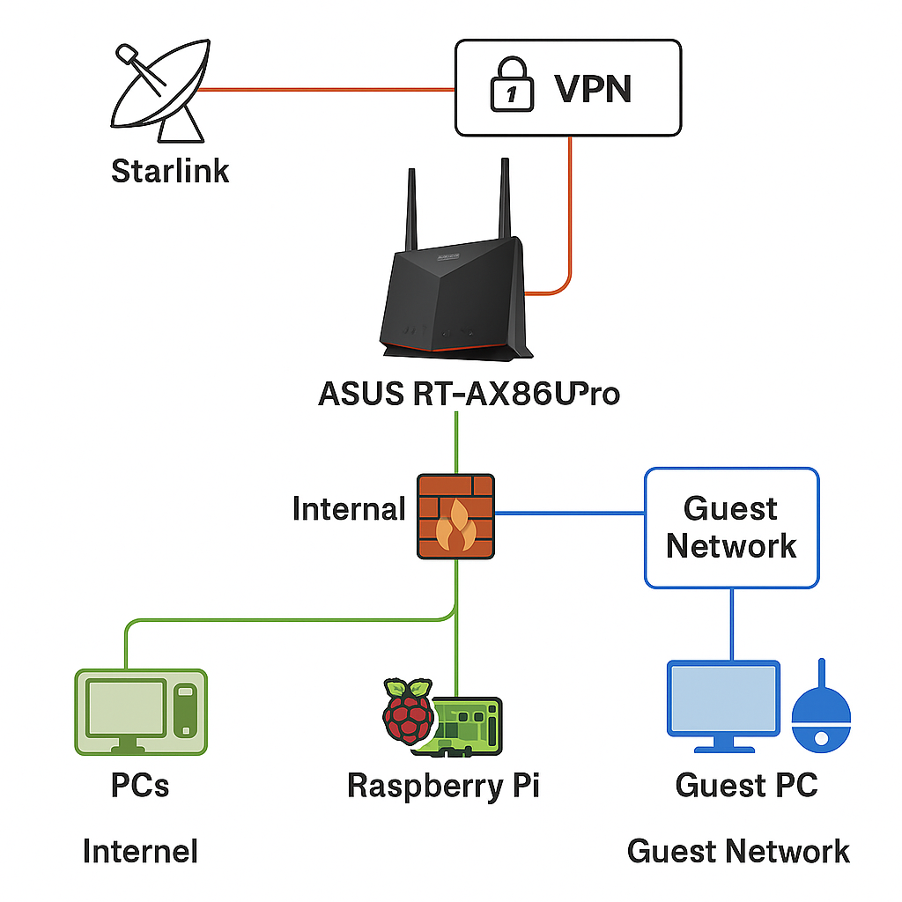
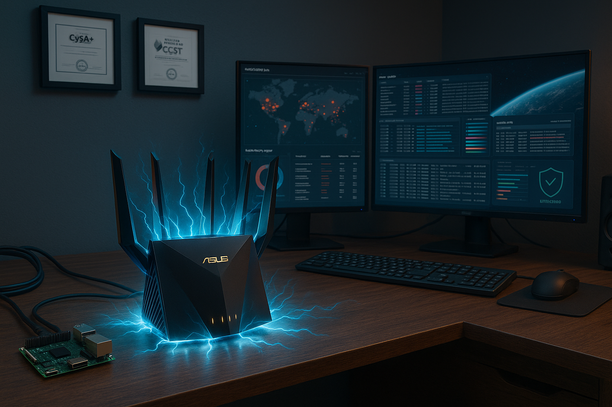

# 🏠 Secure SOHO Network Labs

This repository contains lab exercises focused on securing a small office/home office (SOHO) environment through network segmentation, firewall hardening, device isolation, logging, and threat detection.

---

## 🔧 Included Labs

> More labs coming soon (Sysmon logging, Nessus vulnerability scans, Raspberry Pi SIEM integration)

---

## 📎 Overview

- Designed as a hands-on cybersecurity home lab
- Implements real-world defensive controls
- Uses enterprise methods adapted for consumer gear
- Fully documented for reproducibility and professional use

---

## 🧪 SOHO Network Labs

- 🖨️ **[Secure SOHO Printer Configuration](secure-soho-network-lab/)**  
  Hardens a wireless home printer using static IP reservation, VLAN segmentation, and host-based Windows Firewall rules to restrict port-level access and reduce lateral movement risk. Includes network diagram and documented audit.

> More labs coming soon (Sysmon logging, Nessus vulnerability scans, Raspberry Pi SIEM integration)

## 📸 Network Diagram

<table>
  <tr>
    <td align="center">
       
      Secure SOHO Network
    </td>
    <td align="center">
       
      Feel the Power!
    </td>
  </tr>
</table>

---

