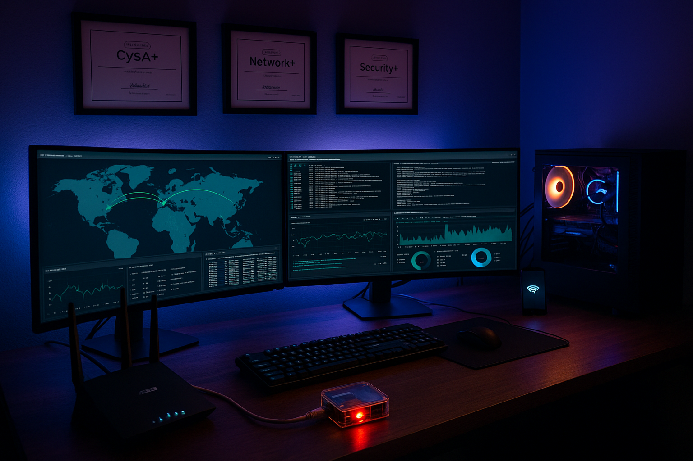
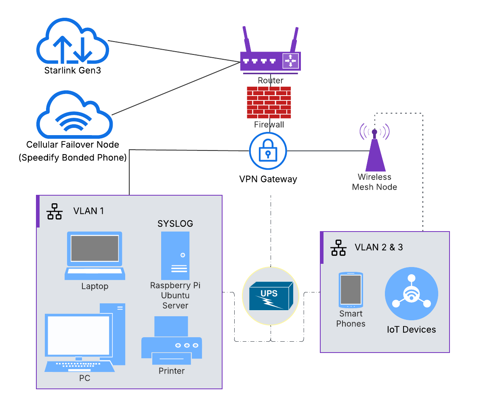

# 🏠 🛡️ Secure Home Lab Network for Cybersecurity Testing & Network Defense

This repository contains lab exercises focused on securing a small office/home office (SOHO) environment through network segmentation, firewall hardening, device isolation, logging, and threat detection.

---

## 🔧 Included Labs

> More labs coming soon (Sysmon logging, Nessus vulnerability scans, Raspberry Pi SIEM integration)

---

## 📎 Overview

- Designed as a hands-on cybersecurity home lab
- Implements real-world defensive controls
- Uses enterprise methods adapted for consumer gear
- Fully documented for reproducibility and professional use

---

## 🧪 SOHO Network Labs

- 🖨️ **[Secure Home Lab Network for Cybersecurity Testing & Network Defense](secure-soho-network-lab/)**  
  This lab documents the architecture and configuration of a secure, segmented home network built using the ASUS RT-AX86U Pro router. It features IoT isolation, VPN Fusion split tunneling with NordVPN, firewall hardening, and centralized syslog logging via a Raspberry Pi 4.

- 🖥️ **[Windows-to-Raspberry Pi Syslog Pipeline](https://github.com/SecOpsPete/secure-soho-network/tree/main/log-forwarding-pipeline)**  
Forwards Windows logs to a Raspberry Pi syslog server using Task Scheduler and PowerShell. Logs are parsed and visualized via a Docker-hosted Elastic Stack on the desktop—no NXLog or Filebeat required.

- 🧠 **[Practical KQL Queries for Detecting SSH & Linux Intrusions](https://github.com/SecOpsPete/secure-soho-network/tree/main/kql-linux-threat-queries)**  
  A collection of Kibana Query Language (KQL) filters designed to detect SSH brute force attempts, failed privilege escalation, suspicious shell spawns, outbound reverse shell activity, and more. Built from syslog data ingested into the ELK stack via Raspberry Pi. Ideal for SOC analysts, home lab defenders, or anyone operating a Linux detection environment.

- 💽 **[Isolated USB Malware Checking Station](https://github.com/secure-soho-network/USB-malware-checking-station/README.md)**  
  This project demonstrates how I built a Raspberry Pi–based station to safely screen USB drives for malware. It uses read-only mounting, ClamAV signature scanning, and log capture on an external SSD. If suspicious files are detected, the workflow escalates to full forensic imaging and offline analysis in Autopsy, ensuring evidence integrity without risking my main systems.

- 🖨️ **[Printer Firewall Hardening](https://github.com/SecOpsPete/cybersecurity-tools/blob/main/printer-firewall-hardening/README.md)**  
  Step-by-step Windows Firewall rule configuration to prevent public access to printers while maintaining local and cloud printing capabilities.

- 🛡️ **[Secure Network Security Profile](https://github.com/SecOpsPete/secure-soho-network/blob/main/network-security-profile/README.md)**  
  Assesses and documents the security posture of a small office/home office (SOHO) network. Highlights layered defenses including VLAN segmentation, BitLocker encryption, firewall rules, router hardening, and endpoint protections. Includes architectural diagram and syslog integration via Raspberry Pi.

> More labs coming soon (Sysmon logging, Nessus vulnerability scans, Raspberry Pi SIEM integration)

## 📸 Network Diagram

<table>
  <tr>
    <td align="center">
       
      Secure SOHO Network
    </td>
    <td align="center">
       
      Feel the Power!
    </td>
  </tr>
</table>

---

