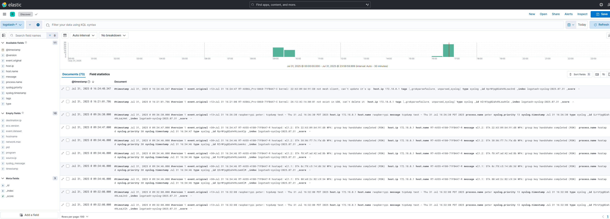

# 📡 Network Log Pipeline: Windows + Router → Raspberry Pi → Dockerized ELK Stack

> ⚙️ This lab demonstrates an agentless log pipeline using built-in Windows tools and rsyslog on a Raspberry Pi, with a full Elastic Stack hosted in Docker for parsing and visualization.

<div align="center">
  
</div>

<br>
This setup forwards logs in real time from:
1. A **Windows 11 PC** using Task Scheduler and a PowerShell UDP sender  
2. An **ASUS router** using standard syslog over UDP port 514

Both sources send logs to a **Raspberry Pi rsyslog server**, which stores the logs locally. The logs are then ingested and parsed by a **Dockerized ELK stack** (Logstash → Elasticsearch → Kibana) hosted on the same Windows desktop.

---

### 🔄 Log Pipeline Flow

```
[Windows Task Scheduler]
    ↓ Send-CriticalLogs.ps1 (PowerShell)
[ASUS Router]
    ↓ syslog over UDP 514
Raspberry Pi (rsyslog)
    ↓ local log file storage
Windows 11 PC (Docker: Logstash)
    ↓ parsed and indexed
Elasticsearch (Docker container)
    ↓ data storage + search
Kibana (Docker container)
```

---

## 🐳 Docker-Hosted ELK Stack (Windows 11)

ELK runs inside Docker containers on your Windows 11 Pro desktop.

📄 `docker-compose.yml`
```yaml
version: '3.7'

services:
  elasticsearch:
    image: docker.elastic.co/elasticsearch/elasticsearch:8.13.4
    environment:
      - discovery.type=single-node
      - xpack.security.enabled=false
    ports:
      - "9200:9200"
    networks:
      - elk

  logstash:
    image: docker.elastic.co/logstash/logstash:8.13.4
    ports:
      - "5000:5000"
      - "514:514/udp"
    volumes:
      - ./logstash.conf:/usr/share/logstash/pipeline/logstash.conf
    networks:
      - elk

  kibana:
    image: docker.elastic.co/kibana/kibana:8.13.4
    ports:
      - "5601:5601"
    environment:
      - ELASTICSEARCH_HOSTS=http://elasticsearch:9200
    networks:
      - elk

networks:
  elk:
    driver: bridge
```

---

## 📄 Logstash Parsing Pipeline (`logstash.conf`)

This configuration parses incoming syslog traffic and extracts structured fields for search and analysis in Kibana. It enhances visibility into network-level activity, especially from the ASUS router (e.g., DHCP assignments from `dnsmasq`).

📄 `logstash.conf`
```conf
input {
  udp {
    port => 514
    host => "0.0.0.0"
    type => "syslog"
  }
}

filter {
  if [type] == "syslog" {
    grok {
      match => {
        "message" => [
          "<%{NUMBER:syslog.priority}>%{SYSLOGTIMESTAMP:syslog.timestamp} %{HOSTNAME:syslog.hostname} %{DATA:syslog.program}(?:\\[%{POSINT:syslog.pid}\\])?: %{GREEDYDATA:syslog.msg}"
        ]
      }
    }

    date {
      match => ["syslog.timestamp", "MMM  d HH:mm:ss", "MMM dd HH:mm:ss"]
      target => "@timestamp"
    }

    if "_grokparsefailure" not in [tags] {
      mutate {
        rename => { "syslog.hostname" => "host.name" }
        rename => { "syslog.program"  => "process.name" }
        rename => { "syslog.pid"      => "process.pid" }
        rename => { "syslog.msg"      => "message" }
      }
    }

    if [process.name] == "dnsmasq-dhcp" {
      grok {
        match => {
          "message" => [
            "%{WORD:dhcp_type}\\(%{WORD:dhcp.interface}\\) %{IP:source.ip} %{MAC:network.mac} %{GREEDYDATA:host.hostname}",
            "%{WORD:dhcp_type}\\(%{WORD:dhcp.interface}\\) %{IP:source.ip} %{MAC:network.mac}",
            "%{WORD:dhcp_type}\\(%{WORD:dhcp.interface}\\) %{MAC:network.mac}"
          ]
        }
      }
    }

    if "_grokparsefailure" in [tags] {
      mutate {
        remove_field => [ "message" ]
        add_tag => ["unparsed_syslog"]
      }
    }
  }
}

output {
  elasticsearch {
    hosts => ["http://elasticsearch:9200"]
    index => "logstash-syslog-%{+YYYY.MM.dd}"
  }
}
```

---

## 🪟 Windows: PowerShell-Based Log Forwarding

To forward critical Windows Event Logs without NXLog or Filebeat, a scheduled task was created that runs a PowerShell script:

📄 `Send-CriticalLogs.ps1`
- Converts selected Event Logs into plain text format
- Sends them via UDP to the Raspberry Pi's IP on port 514
- Uses `System.Net.Sockets.UdpClient`

🔧 Sample logic:
```powershell
$udpClient = New-Object System.Net.Sockets.UdpClient
$serverIp = "192.168.50.2"  # Raspberry Pi IP
$serverPort = 514

Get-WinEvent -LogName System -MaxEvents 5 | ForEach-Object {
    $message = $_.Message
    $bytes = [System.Text.Encoding]::UTF8.GetBytes($message)
    $udpClient.Send($bytes, $bytes.Length, $serverIp, $serverPort) | Out-Null
}
$udpClient.Close()
```

### 📅 Task Scheduler Setup

- **Trigger:** At startup or every 5 minutes  
- **Action:**
  ```
  powershell.exe -ExecutionPolicy Bypass -File "C:\Path\To\Send-CriticalLogs.ps1"
  ```
- **Settings:**
  - Run with highest privileges  
  - Configure for Windows 10/11

---

## 📥 Raspberry Pi: rsyslog Configuration

📄 `/etc/rsyslog.d/10-router.conf`
```rsyslog
$template RouterLogFile,"/var/log/remote/router.log"
if ($fromhost-ip == '192.168.50.1') then -?RouterLogFile
& stop
```

📄 `/etc/rsyslog.d/10-winlogs.conf`
```rsyslog
$template WinLogFile,"/var/log/remote/winlogs.log"
if ($fromhost-ip == '192.168.50.3') then -?WinLogFile
& stop
```

Create log directories:
```bash
sudo mkdir -p /var/log/remote
sudo touch /var/log/remote/router.log
sudo touch /var/log/remote/winlogs.log
sudo chown syslog:adm /var/log/remote/*.log
sudo systemctl restart rsyslog
```

🧠 Why This Matters

This configuration:

- Organizes logs by source **before** they enter the ELK pipeline  
- Simplifies parsing in Logstash (I already know what device sent which file)  
- Makes debugging and validation much easier  
- Helps with compliance and retention policies by splitting log sources cleanly  

---

## 📶 ASUS Router: Remote Syslog Settings

1. Log in to web UI → **Administration > System Log > Remote Log Server**
2. Enable logging
3. Set:
   - **Remote Log Server**: `192.168.50.2` (your Pi)
   - **Port**: `514`

---

## 📊 Kibana: Viewing the Logs

Open:
```
http://localhost:5601
```

### 🔧 Setup:
1. Go to **Stack Management → Index Patterns**
2. Create: `logstash-*`
3. Select `@timestamp` as the time field

### 🔍 Quick Log Search Tip
Use the **Discover** tab and set the time range to "Last 15 minutes" after generating new logs.

<div align="center">
  
</div>

---

## 🗃️ Elasticsearch: 30-Day Log Retention via ILM

To prevent disk overuse and ensure long-term visibility without manual cleanup, a **30-day Index Lifecycle Management (ILM) policy** is applied to all `logstash-*` indices in Elasticsearch.

###  ILM Policy: `log-retention-30d`

```json
PUT _ilm/policy/log-retention-30d
{
  "policy": {
    "phases": {
      "hot": {
        "actions": {}
      },
      "delete": {
        "min_age": "30d",
        "actions": {
          "delete": {}
        }
      }
    }
  }
}
```

###  Index Template: `logstash-template`

```json
PUT _index_template/logstash-template
{
  "index_patterns": ["logstash-*"],
  "template": {
    "settings": {
      "index": {
        "lifecycle": {
          "name": "log-retention-30d"
        },
        "number_of_shards": 1,
        "number_of_replicas": 0
      }
    }
  },
  "priority": 10,
  "_meta": {
    "description": "Applies 30-day ILM policy to logstash indices"
  }
}
```

###  Retroactive Policy Attachment

```json
PUT logstash-2025.07.06/_settings
{
  "index": {
    "lifecycle": {
      "name": "log-retention-30d"
    }
  }
}
```

###  Verified Status

```json
GET logstash-2025.07.06/_ilm/explain
```

Expected output:
```json
"policy": "log-retention-30d",
"managed": true,
"phase": "hot",
"step": "complete"
```

---

## ✅ Final Status Overview

| Component                | Status                         |
|--------------------------|--------------------------------|
| Raspberry Pi rsyslog     | ✅ Receiving router + Win logs |
| Windows Scheduled Task   | ✅ Sending logs via UDP         |
| Logstash (Docker)        | ✅ Listening on 5000 + 514      |
| Elasticsearch (Docker)   | ✅ Accepting parsed events       |
| Kibana (Docker)          | ✅ Visualizing logs              |

---

🛡️ *Part of the [secure-soho-network](https://github.com/SecOpsPete/secure-soho-network) lab repository.*
