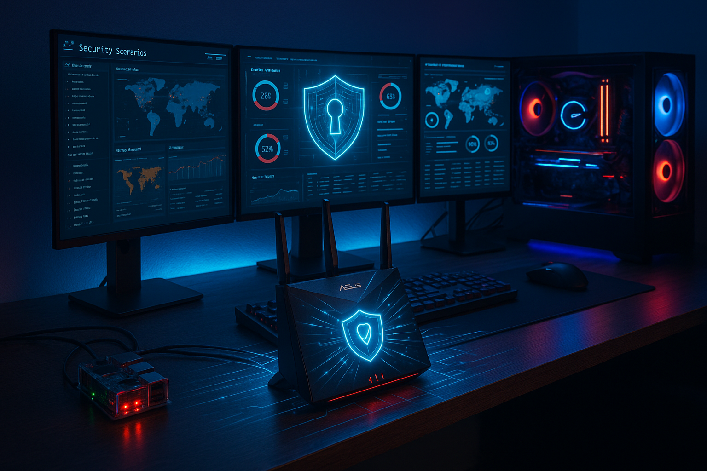

# 🛡️ Home Network Security Posture Audit

This audit summarizes the current state of my SOHO (Small Office/Home Office) network security lab. It reflects the layered defenses, segmentation, endpoint hardening, and monitoring practices I have in place as of September 2025.

---

## 🔐 Summary

| Category                       | Posture     | Notes                                                                 |
|-------------------------------|-------------|-----------------------------------------------------------------------|
| **Network Segmentation**      | ★★★★★       | IoT VLAN isolated via mesh node, strict inter-VLAN firewall rules     |
| **Router Hardening**          | ★★★★★       | ASUS RT-AX86U Pro + AiMesh node; DNSSEC, static IPs, secure WiFi      |
| **Endpoint Protection**       | ★★★★☆       | BitLocker, Defender, Malwarebytes, firewall tuning, Sysmon planned   |
| **Printer Security**          | ★★★★★       | Static IP, inbound blocked, outbound restricted, no public exposure   |
| **Threat Monitoring**         | ★★★★☆       | Raspberry Pi syslog + ELK stack + Fail2Ban + Nessus                   |
| **External Exposure**         | ★★★★★       | CGNAT via Starlink, no inbound services, VPN enforced outbound        |
| **Vulnerability Management**  | ★★★★☆       | Windows + firmware patching, Nessus scanning, roadmap to Wazuh        |

<br>
<div align="center">
  
</div>

---

## 🧱 Network Segmentation & VLANs

- 🛑 I keep IoT devices isolated on a guest SSID/VLAN through my **AX55 mesh node**
- ✅ My main VLAN is reserved for trusted devices (desktop, printer, Pi, laptop)
- 🔄 No lateral access is allowed from IoT → Main
- 🎯 Static IP reservations are configured for all critical nodes (router, Pi, printer, desktop)
- 🔧 I also use VLAN assignments for my future Pi forensic station

---

## 🔒 Endpoint & Printer Hardening

- 🖥️ On my Windows 11 hosts:
  - BitLocker full-disk encryption is enabled
  - Malwarebytes runs alongside Microsoft Defender
  - Sysmon and event forwarding are on my roadmap
- 🖨️ Printer:
  - Static IP: `192.168.50.38`
  - Blocked ports (`9100`, `515`, `631`) on public profiles
  - Inbound is restricted to my trusted desktop only
  - Outbound is limited to HP Smart cloud services
- 🛡️ I’ve tuned my firewall with custom rules and logging

---

## 🛰️ Router & Perimeter Defense

- Core Router: **ASUS RT-AX86U Pro**
- Mesh Node: **ASUS RT-AX55** (handles IoT VLAN isolation)
- WAN: **Starlink with CGNAT** (no inbound exposure)
- VPN:
  - **NordVPN on endpoints** (with plans for router-level policy rules)
  - Future: employer VPN integration (OpenVPN/IPSec)
- **DNSSEC is enabled** to prevent DNS spoofing
- DHCP reservations are active
- The admin GUI is only accessible from the LAN
- Guest network isolation is enforced

---

## 🔍 Threat Detection & Monitoring

- ✅ I use a Raspberry Pi as a hardened syslog server:
  - SSH keys only, password login disabled
  - UFW firewall rules in place
  - SSH restricted to LAN only
  - Fail2Ban active
- 📡 The Pi forwards logs to my **ELK stack on the Windows desktop**
  - Logstash parses syslog
  - Kibana dashboards give me live review
  - ELK ports are locked down to `192.168.50.3`
- 🔎 Nessus Essentials runs regular scans
- 📝 Sysmon + Windows Event Forwarding are planned
- 🔮 Longer term, I may feed logs into a SIEM (Wazuh, Splunk, or Graylog)

---

## 🌐 Internet Exposure Controls

- ✅ CGNAT provides default inbound shielding
- 🔒 I don’t use port forwarding or a DMZ
- 🔎 Shodan/ShieldsUP scans confirm zero open ports
- 🌍 I rely on VPNs for secure outbound browsing
- 🚫 I removed NXLog due to instability and now rely on Logstash for log forwarding

---

## 🧰 Vulnerability Management

- 🔎 I use Nessus Essentials to scan my printer, PC, and router
- 🔧 I apply Windows updates and vendor firmware updates on a routine cycle
- 📘 My goal is to formalize a scan → remediate → document cycle
- 🚀 DNSSEC is now part of my baseline router hardening

---

## 🧠 Takeaway

My home lab reflects a professional-grade security architecture in a SOHO environment.  
I’ve combined DNSSEC-hardened DNS resolution, IoT network isolation via my mesh node, host-level hardening, syslog/ELK monitoring, and CGNAT-backed external shielding.  

With future enhancements like Sysmon logging, SIEM integration, and automated patch reporting, I’ll continue pushing this lab closer to enterprise standards.
```

Want me to also update your **diagram** so it shows the mesh node isolating IoT and the DNSSEC protection layer?
