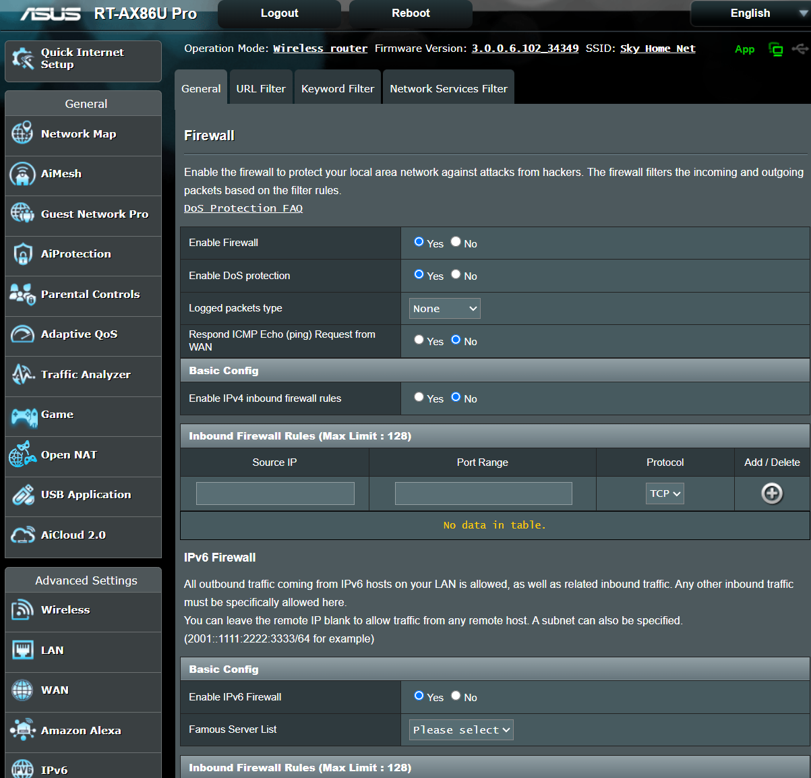
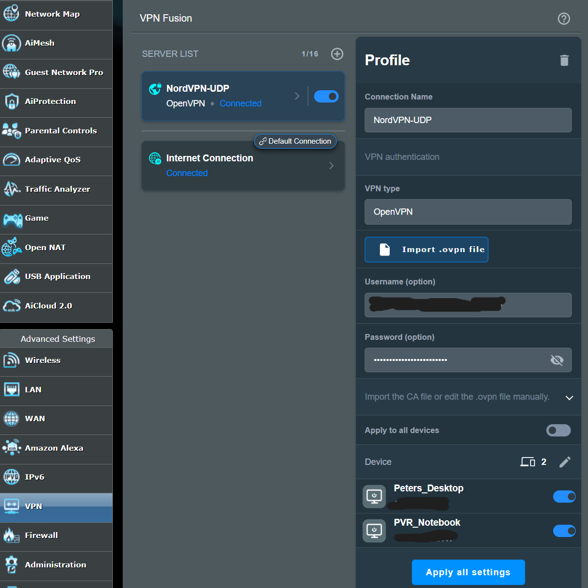

# 🛡️ Home Network Security Lab

This lab documents the architecture and configuration of a secure, segmented home network built using the ASUS RT-AX86U Pro router. It features IoT isolation, VPN Fusion split tunneling with NordVPN, firewall hardening, and centralized syslog logging via a Raspberry Pi 4.

---

## 🌐 Network Diagram

<div align="center">
  
</div>

---

## 🔧 Router Configuration Summary

### ✔️ Wireless Settings

| Band | SSID | Security | Bandwidth | Features |
|------|------|----------|-----------|----------|
| 2.4GHz | SecOpsPete_Main | WPA2-Personal / AES | 20/40 MHz | Wi-Fi 6, PMF Capable, Agile Multiband |
| 5GHz | SecOpsPete_Main | WPA2-Personal / AES | 80 MHz | Wi-Fi 6, TWT, Agile Multiband |
| Guest (2.4GHz) | Old IoT SSID | WPA2-Personal / AES | 20 MHz | Intranet Access Disabled, Device Isolation Enabled |

---

## 🔐 Router Hardening & Firewall

| Feature | Status |
|--------|--------|
| HTTPS Admin Access | ✅ Enabled on port 8443 |
| Admin Login Captcha | ✅ Enabled |
| Remote Admin (WAN) | ❌ Disabled |
| Default Admin Username Changed | ✅ Yes |
| WPS | ❌ Disabled |
| UPnP | ❌ Disabled |
| SSH Access | ❌ Disabled |
| Auto-Logout Timer | ✅ 10 minutes |
| IPv6 Firewall | ✅ Enabled (Deny unsolicited traffic) |
| DoS Protection | ✅ Enabled |
| WAN Ping Response | ❌ Disabled |
| IPv4 Inbound Rules | ❌ Disabled |
| Port Forwarding | ❌ Disabled |

<br>


<div align="center">
  
</div>


---

## 🧠 AiProtection (Trend Micro)

| Module | Status |
|--------|--------|
| Malicious Site Blocking | ✅ Enabled |
| Two-Way IPS | ✅ Enabled |
| Infected Device Quarantine | ✅ Enabled |
| Router Security Scan | ✅ All green ✅ |

---

## 🔄 VPN Fusion – Split Tunneling

### NordVPN Integration
- ✅ OpenVPN client profile uploaded
- ✅ Auto-reconnect enabled
- ✅ “Start with WAN” enabled
- ✅ Only selected devices routed through VPN
<br>
<div align="center">
  
</div>


---

### Device Routing Table

| Device | Route |
|--------|--------|
| 🧠 Desktop / Laptop | 🔐 NordVPN |
| 📱 iPhone | 🌐 Starlink WAN |
| 📺 Smart TV | 🌐 Starlink WAN |
| 🔌 IoT Devices (e.g. plugs, switches) | 🌐 Starlink WAN |
| 🖨️ Printer | 🌐 Starlink WAN |
| 🐧 Raspberry Pi (Syslog Server) | 🌐 Starlink WAN |

---

## 📊 Logging and Monitoring

### Raspberry Pi 4 Syslog Server

| Component     | Configuration                                         |
|---------------|-------------------------------------------------------|
| Hardware      | Raspberry Pi 4B (4GB RAM)                             |
| OS            | Raspberry Pi OS Lite                                 |
| Logging Tool  | `rsyslog`                                             |
| Syslog Port   | UDP 514                                               |
| Static IP     | `192.168.50.100`                                      |
| Function      | Receives router logs and forwards them to ELK stack  |
| Log Access    | `/var/log/syslog`, `journalctl`, or view in Kibana   |

> The Raspberry Pi collects system logs from the ASUS router and securely forwards them to a Logstash container running on the desktop. Log lifecycle is controlled via Elasticsearch ILM (7-day retention).

---

### ELK Stack Integration (Desktop)

| Component        | Details                                                    |
|------------------|------------------------------------------------------------|
| Logstash         | Listens on TCP/UDP 5000 for JSON logs                      |
| Elasticsearch    | Stores logs in `logs-generic-default` data stream         |
| Kibana           | Used to visualize and query logs from the Pi and router   |
| ILM Policy       | Retains logs for 7 days, deletes automatically afterward   |

> The ELK stack is running in Docker on a Windows desktop. Logstash is configured to accept logs on port 5000 and forward them into Elasticsearch with a retention policy.

---

### Raspberry Pi Setup Summary

1. **SSH Enabled** via blank `ssh` file on boot volume.
2. **Static IP Set**: `192.168.50.100`
3. **Installed rsyslog**:
   ```bash
   sudo apt update && sudo apt install -y rsyslog
   ```
4. **Configured `/etc/rsyslog.conf`**:
   ```conf
   module(load="imudp")
   input(type="imudp" port="514")

   *.* @@192.168.50.3:5000
   ```
   > Forwarding logs to Logstash listener on desktop (`192.168.50.3`).

5. **Restarted Service**:
   ```bash
   sudo systemctl restart rsyslog
   ```

---

### Validation

| Check                              | Result                    |
|------------------------------------|---------------------------|
| Log received by Raspberry Pi       | ✅ Verified via `journalctl` |
| Forwarded to ELK stack             | ✅ Seen in Kibana Discover |
| Log Retention Functionality        | ✅ ILM 7-day delete policy |
| Query Test in Kibana               | ✅ `@timestamp < now-7d/d` returns no results |

---

### Additional Notes

- Confirmed `logstash.conf` uses JSON codec for both TCP/UDP on port 5000.
- All data is centralized in Kibana for easy visualization and alerting.
- ILM policies are enforced through the Kibana UI with confirmed deletion timelines.
- Dashboard visualizations are filtered to reflect only current, retained logs.

```bash
# From Raspberry Pi to test logging:
logger "Test syslog message from Raspberry Pi"
```

✅ The Raspberry Pi syslog server is now fully integrated and operational

---

## 🧪 Validation

| Test | Result |
|------|--------|
| HTTPS login enforced | ✅ https://192.168.50.1:8443 |
| IP Test (PC) | ✅ Shows NordVPN IP (`45.132.159.12`) |
| IP Test (iPhone) | ✅ Shows Starlink IP |
| Guest Network Isolation | ✅ IoT devices can’t reach LAN |
| AiProtection Scan | ✅ All green |
| Syslog Entries Received | ✅ Confirmed from ASUS to Pi |

---

## 📦 Hardware Summary

| Device | Role |
|--------|------|
| ASUS RT-AX86U Pro | Core router, firewall, wireless controller |
| Starlink Ethernet Adapter | Internet uplink (bypass mode) |
| Raspberry Pi 4B | Syslog server, future SIEM/logging node |
| Laptops / PCs | VPN-routed trusted devices |
| IoT Devices | Segmented via guest network |


<br>
<div align="center">
  
</div>

---

## 🗂️ Future Enhancements

- [ ] Add Pi-hole DNS filtering on Raspberry Pi
- [ ] Integrate Grafana + Loki or ELK stack for log visualization
- [ ] Add fail2ban to detect/restrict suspicious IPs
- [ ] Enable alerts/log forwarding to external storage
- [ ] Expand GitHub documentation with Raspberry Pi setup scripts

---

## 🧠 Author

**SecOpsPete**  
[GitHub](https://github.com/SecOpsPete) | Cybersecurity Analyst in training | Network Defense | Threat Hunting | Home Lab Projects


