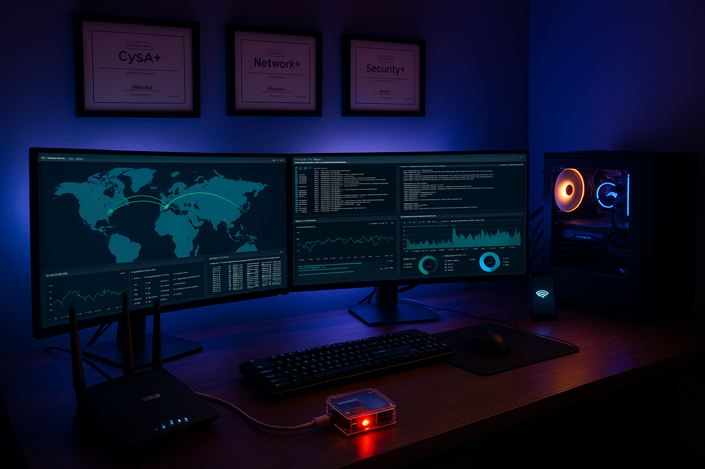

# 🛡️ Secure Home Lab Network for Cybersecurity Testing & Network Defense

This lab simulates a production-grade network environment within a home setting, designed for cybersecurity experimentation, monitoring, and resilience testing. It incorporates enterprise-style features such as VLAN segmentation, centralized logging via ELK, dual-ISP failover with Speedify, VPN split tunneling, and endpoint hardening. With layered defenses, proactive visibility, and purpose-built redundancy, this environment enables hands-on testing of SIEM pipelines, threat detection, and secure architecture principles in a controlled and realistic setting.

### 💻 Cybersecurity War Machine Specs:
* Intel Core i9-13900K (24c/32t, nearly 6GHz turbo)
* NVIDIA RTX 5070 (Blackwell, 12GB GDDR7)
* 64GB DDR5 @ 6000+ MHz
* Samsung 990 Pro 2TB + Lexar NM790 1TB (both NVMe)
* MSI PRO Z790-P WIFI (PCIe 5.0, DDR5 support)
* MSI MAG A850GL PSU (ATX 3.1, PCIe 5.1)
<br>

<div align="center">
  
</div>

Key features include:

- **Network Segmentation:** Trusted, IoT, guest, and mobile devices are isolated to reduce lateral movement risk.
- **ISP Redundancy:** Dedicated cellular phone data bonded via Speedify acts as a secondary ISP link.
- **Manual Channel Optimization:** Wireless channels are strategically assigned for performance and device compatibility.
- **VPN Fusion:** Select devices route traffic through NordVPN while others use direct ISP or cellular access.
- **Firewall Hardening:** Unsolicited traffic is blocked at the router and endpoint level using UFW and secure defaults.
- **Centralized Logging:** A Raspberry Pi syslog server forwards logs to a Dockerized ELK stack for real-time visibility.
- **DNS Hardening:** DNSSEC validation and DNS-over-TLS encryption are enforced at the router to ensure authenticity and privacy of DNS lookups.
- **Power Protection:** A CyberPower UPS provides battery backup and voltage regulation for critical devices.
- **Scalability:** Modular logging, ECS compliance, and containerized services allow future SIEM integration and enterprise-grade monitoring.

This evolving lab serves as a realistic platform for testing endpoint defense, log analysis, and secure networking—all within a controlled home environment.

---

## 🌐 Network Diagram

<div align="center">
  
</div>

---

## 🔧 Router Configuration Summary

### ✔️ Wireless Settings

| Band | SSID | Security | Bandwidth | Features |
|------|------|----------|-----------|----------|
| 2.4GHz | SecOpsPete_Main | WPA2-Personal / AES | 20/40 MHz | Wi-Fi 6, PMF Capable, Agile Multiband |
| 5GHz | SecOpsPete_Main | WPA2-Personal / AES | 80 MHz | Wi-Fi 6, TWT, Agile Multiband |
| Guest (2.4GHz) | Old IoT SSID | WPA2-Personal / AES | 20 MHz | Intranet Access Disabled, Device Isolation Enabled |

> The ASUS ZenWiFi XT9 AX7800 is configured as a dedicated Access Point (AP), extending Wi-Fi coverage while maintaining a unified SSID structure and inheriting all security policies from the RT-AX86U Pro core router.

---

### 🌐 DNSSEC & Encrypted DNS Configuration

The RT-AX86U Pro router is hardened with **DNSSEC validation** and **DNS-over-TLS (DoT)** to protect DNS integrity and privacy across the home lab:

| Setting                        | Value                         |
|--------------------------------|-------------------------------|
| **DNS Privacy Protocol**       | DNS-over-TLS (DoT)            |
| **Profile**                    | Strict (no fallback allowed)  |
| **Primary Resolver**           | Quad9 (`9.9.9.9`, `dns.quad9.net`) |
| **Secondary Resolver**         | Cloudflare (`1.1.1.1`, `cloudflare-dns.com`) |
| **Enable DNSSEC Support**      | ✅ Yes                        |
| **Validate Unsigned Replies**  | ✅ Yes (rejects bogus responses) |
| **Prevent Client Auto DoH**    | ✅ Yes (forces router-controlled DNS) |
| **DNS Rebind Protection**      | ✅ Enabled                    |

> This configuration ensures all DNS lookups are both **encrypted in transit** and **cryptographically validated** at the router level. Quad9 provides additional security filtering for malicious domains, while Cloudflare acts as a resilient fallback. Clients cannot bypass DNS policy using DoH, guaranteeing consistent enforcement across the network.

---

### 📡 ISP Redundancy and Bypass Configuration
*(unchanged)*

---

## 📌 Static IP Addressing Strategy
*(unchanged)*

---

### 📡 Advanced Wireless Channel Planning
*(unchanged)*

---

## 🔐 Router Hardening & Firewall

| Feature | Status |
|--------|--------|
| HTTPS Admin Access | ✅ Enabled on port 8443 |
| Admin Login Captcha | ✅ Enabled |
| Remote Admin (WAN) | ❌ Disabled |
| Default Admin Username Changed | ✅ Yes |
| Router Syslog Forwarding | ✅ Enabled to Pi Syslog Server (UDP/514) |
| **DNSSEC + DoT** | ✅ Enforced (Quad9 + Cloudflare) |
| WPS | ❌ Disabled |
| UPnP | ❌ Disabled |
| SSH Access | ❌ Disabled |
| Auto-Logout Timer | ✅ 10 minutes |
| IPv6 Firewall | ✅ Enabled (Deny unsolicited traffic) |
| DoS Protection | ✅ Enabled |
| WAN Ping Response | ❌ Disabled |
| IPv4 Inbound Rules | ❌ Disabled |
| Port Forwarding | ❌ Disabled |

<br>

---

## 🧠 AiProtection (Trend Micro)

AiProtection is a built-in security suite powered by **Trend Micro**, integrated directly into the ASUS RT-AX86U Pro router. It provides proactive, router-level threat prevention for all devices on the network — especially useful for IoT and guest clients that may lack built-in defenses.

Unlike endpoint antivirus, AiProtection inspects traffic at the perimeter, offering continuous monitoring and automatic blocking of known threats.

| Module                    | Status      | Description                                                                 |
|---------------------------|-------------|-----------------------------------------------------------------------------|
| **Malicious Site Blocking**    | ✅ Enabled   | Prevents access to known phishing domains and malicious URLs.               |
| **Two-Way IPS**                | ✅ Enabled   | Detects and blocks suspicious inbound and outbound traffic.                 |
| **Infected Device Quarantine**| ✅ Enabled   | Automatically isolates compromised devices to prevent lateral movement.     |
| **Router Security Scan**       | ✅ All green ✅ | Periodic scans confirm strong security posture and no risky configurations. |

> AiProtection provides an added layer of baseline security, complementing the network's segmented topology, firewall rules, and centralized log monitoring. While it doesn't replace host-based security tools, it strengthens the first line of defense at the network edge.

---

## 🔄 VPN Fusion – Split Tunneling

The ASUS RT-AX86U Pro supports **VPN Fusion**, which allows selected devices to use a VPN connection while others access the internet directly via the ISP (Starlink). This setup balances **privacy, speed, and functionality** based on each device's role.

### Device Routing Table

| Device                                | Route            |
|----------------------------------------|------------------|
| 🧠 Desktop / Laptop                    | 🔐 NordVPN       |
| 📱 iPhone                              | 🌐 Starlink WAN  |
| 📺 Smart TV                            | 🌐 Starlink WAN  |
| 🔌 IoT Devices (e.g. plugs, switches)  | 🌐 Starlink WAN  |
| 🖨️ Printer                             | 🌐 Starlink WAN  |
| 🐧 Raspberry Pi (Syslog Server)        | 🌐 Starlink WAN  |

> Devices with privacy or security requirements (like your main desktop) are routed through NordVPN, while bandwidth-sensitive or low-risk devices (like IoT, printers, and media streamers) use the direct Starlink connection.


---

## 📊 Logging and Monitoring

### Raspberry Pi 4 Syslog Server

| Component     | Configuration                                         |
|---------------|-------------------------------------------------------|
| Hardware      | Raspberry Pi 4B (4GB RAM)                             |
| OS            | Raspberry Pi OS Lite                                 |
| Logging Tool  | `rsyslog`                                             |
| Syslog Port   | UDP 514                                               |
| Static IP     | `192.168.50.100`                                      |
| Function      | Receives router logs and forwards them to ELK stack  |
| Log Access    | `/var/log/syslog`, `journalctl`, or view in Kibana   |

> The Raspberry Pi collects system logs from the ASUS router and securely forwards them to a Logstash container running on the desktop. Log lifecycle is controlled via Elasticsearch ILM (7-day retention).

---

### ELK Stack Integration (Desktop)

| Component        | Details                                                    |
|------------------|------------------------------------------------------------|
| Logstash         | Listens on TCP/UDP 5000 for JSON logs                      |
| Elasticsearch    | Stores logs in `logs-generic-default` data stream         |
| Kibana           | Used to visualize and query logs from the Pi and router   |
| ILM Policy       | Retains logs for 7 days, deletes automatically afterward   |

> The ELK stack is running in Docker on a Windows desktop. Logstash is configured to accept logs on port 5000 and forward them into Elasticsearch with a retention policy.

---

### Raspberry Pi Setup Summary

1. **SSH Enabled** via blank `ssh` file placed on the boot volume.
2. **Static IP Set** to `192.168.50.100`.
3. **Installed rsyslog**:
   ```bash
   sudo apt update && sudo apt install -y rsyslog
   ```
4. **Configured `/etc/rsyslog.conf`** to receive and forward logs:
   ```conf
   module(load="imudp")
   input(type="imudp" port="514")

   *.* @@192.168.50.3:5000
   ```
   > Forwards logs to Logstash listener on desktop (`192.168.50.3`).

5. **Restarted rsyslog service**:
   ```bash
   sudo systemctl restart rsyslog
   ```

---

### 🔐 Hardening and Firewall Configuration

| Feature                       | Status     | Details                                                                 |
|------------------------------|------------|-------------------------------------------------------------------------|
| SSH Key Authentication       | ✅ Enabled | Password logins disabled; login restricted to SSH key from desktop     |
| Root Login                   | ❌ Disabled | `PermitRootLogin no` in `sshd_config`                                  |
| UFW Firewall                 | ✅ Active   | Allows SSH from LAN, syslog on UDP 514, and Elastic ports from desktop |
| Elastic Stack Port Filtering | ✅ Applied  | Ports 5000, 9200, 5601 restricted to `192.168.50.3`                    |
| Fail2Ban                     | ✅ Installed & Active | Bans after 5 failed SSH attempts for 1 hour                      |

UFW Rules Summary:
```bash
sudo ufw allow from 192.168.50.0/24 to any port 22
sudo ufw allow 514/udp
sudo ufw allow out on eth0
sudo ufw allow in on lo
sudo ufw allow from 192.168.50.3 to any port 5000
sudo ufw allow from 192.168.50.3 to any port 9200
sudo ufw allow from 192.168.50.3 to any port 5601
sudo ufw enable
```

Fail2Ban Config (`/etc/fail2ban/jail.local`):
```ini
[sshd]
enabled = true
port    = ssh
logpath = /var/log/auth.log
maxretry = 5
bantime = 3600
findtime = 600
```

Fail2Ban Commands:
```bash
# Check status of the SSH jail
sudo fail2ban-client status sshd

# View current bans (if any)
sudo fail2ban-client status
```

---

## ✅ Validation

| Check                                  | Result                          |
|----------------------------------------|---------------------------------|
| SSH key-based access from desktop      | ✅ Enabled and tested            |
| SSH access restricted to desktop       | ✅ Confirmed                     |
| Syslog data received by Pi             | ✅ Verified via `journalctl`     |
| Logs forwarded to ELK stack            | ✅ Seen in Kibana Discover       |
| Firewall blocks unauthorized ports     | ✅ Confirmed with `ufw status`   |
| Fail2Ban enforcement                   | ✅ `fail2ban-client status sshd` |
| Log Retention                          | ✅ ILM 7-day delete policy       |
| Kibana query test                      | ✅ `@timestamp < now-7d/d` empty |

> The Raspberry Pi accepts SSH connections only from the desktop, authenticated via public/private key pair. Password-based logins and remote root access are disabled for security.

---

### Additional Notes

- Confirmed `logstash.conf` uses JSON codec for both TCP/UDP on port 5000.
- All data is centralized in Kibana for easy visualization and alerting.
- ILM policies are enforced through the Kibana UI with confirmed deletion timelines.
- Dashboard visualizations are filtered to reflect only current, retained logs.

```bash
# From Raspberry Pi to test logging:
logger "Test syslog message from Raspberry Pi"
```

✅ The Raspberry Pi syslog server is now fully integrated and operational

---

### 🔋 Power Redundancy (UPS)

The entire networking stack is protected by a **CyberPower CP1500PFCLCD PFC Sinewave UPS System**:

- **Capacity:** 1500VA / 1000W
- **Outlets:** 12 total (6 battery + surge, 6 surge-only)
- **Features:** Active PFC compatibility, LCD diagnostics, Automatic Voltage Regulation (AVR)

> This UPS ensures uninterrupted power delivery to critical infrastructure including the ASUS RT-AX86U Pro, ZenWiFi XT9 AP, Raspberry Pi syslog server, and desktop running the ELK stack. It adds resilience during short-term outages and safeguards against voltage fluctuations, aligning the lab environment more closely with enterprise continuity practices.

---

## 📦 Hardware Summary

| Device                 | Role                                             |
|------------------------|--------------------------------------------------|
| ASUS RT-AX86U Pro      | Core router, firewall, wireless controller       |
| ASUS RT-AX55           | AiMesh node w/ segmented VLAN SSIDs             |
| Starlink Ethernet Adapter | Primary uplink (Bypass Mode)                |
| Smartphone (5G)        | Cellular failover ISP node                      |
| Wi-Fi Repeater         | Bridges smartphone to LAN                       |
| USB Hub (bus-powered)  | Supplies power to repeater and phone            |
| Raspberry Pi 4B        | Syslog, log forwarder, future SIEM              |
| CyberPower UPS         | Surge protection + power continuity             |
| Desktop (Docker Host)  | ELK stack, firewall controller                  |

---

## 🧠 Author

**SecOpsPete**  
[GitHub](https://github.com/SecOpsPete) | Cybersecurity Analyst in training | Network Defense | Threat Hunting | Home Lab Projects
